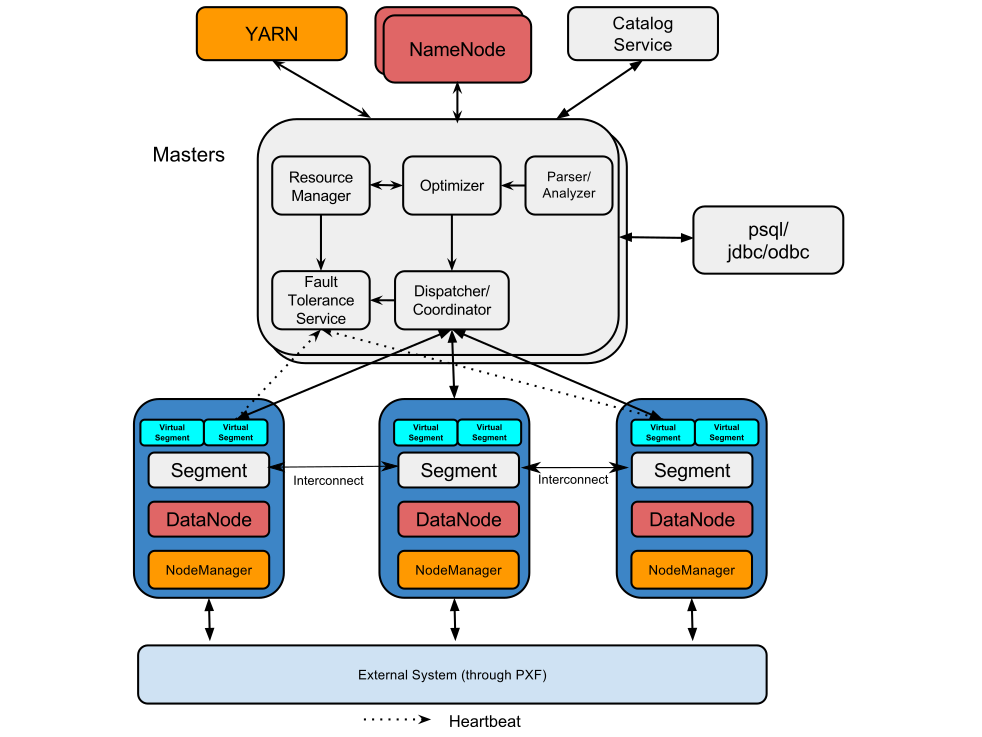

<!--
Licensed to the Apache Software Foundation (ASF) under one
or more contributor license agreements.  See the NOTICE file
distributed with this work for additional information
regarding copyright ownership.  The ASF licenses this file
to you under the Apache License, Version 2.0 (the
"License"); you may not use this file except in compliance
with the License.  You may obtain a copy of the License at

  http://www.apache.org/licenses/LICENSE-2.0

Unless required by applicable law or agreed to in writing,
software distributed under the License is distributed on an
"AS IS" BASIS, WITHOUT WARRANTIES OR CONDITIONS OF ANY
KIND, either express or implied.  See the License for the
specific language governing permissions and limitations
under the License.
-->

This topic presents HAWQ architecture and its main components.

In a typical HAWQ deployment, each slave node has one physical HAWQ segment, an HDFS DataNode and a NodeManager installed. Masters for HAWQ, HDFS and YARN are hosted on separate nodes.

The following diagram provides a high-level architectural view of a typical HAWQ deployment.

HAWQ is tightly integrated with YARN, the Hadoop resource management framework, for query resource management. HAWQ caches containers from YARN in a resource pool and then manages those resources locally by leveraging HAWQ's own finer-grained resource management for users and groups. To execute a query, HAWQ allocates a set of virtual segments according to the cost of a query, resource queue definitions, data locality and the current resource usage in the system. Then the query is dispatched to corresponding physical hosts, which can be a subset of nodes or the whole cluster. The HAWQ resource enforcer on each node monitors and controls the real time resources used by the query to avoid resource usage violations.

The following diagram provides another view of the software components that constitute HAWQ.

## HAWQ Master 

The HAWQ *master* is the entry point to the system. It is the database process that accepts client connections and processes the SQL commands issued. The HAWQ master parses queries, optimizes queries, dispatches queries to segments and coordinates the query execution.

End-users interact with HAWQ through the master and can connect to the database using client programs such as psql or application programming interfaces \(APIs\) such as JDBC or ODBC.

The master is where the `global system catalog` resides. The global system catalog is the set of system tables that contain metadata about the HAWQ system itself. The master does not contain any user data; data resides only on *HDFS*. The master authenticates client connections, processes incoming SQL commands, distributes workload among segments, coordinates the results returned by each segment, and presents the final results to the client program.

## HAWQ Segment 

In HAWQ, the *segments* are the units that process data simultaneously.

There is only one *physical segment* on each host. Each segment can start many Query Executors \(QEs\) for each query slice. This makes a single segment act like multiple virtual segments, which enables HAWQ to better utilize all available resources.

**Note:** In this documentation, when we refer to segment by itself, we mean a *physical segment*.

A *virtual segment* behaves like a container for QEs. Each virtual segment has one QE for each slice of a query. The number of virtual segments used determines the degree of parallelism \(DOP\) of a query.

A segment differs from a master because it:

-   Is stateless.
-   Does not store the metadata for each database and table.
-   Does not store data on the local file system.

The master dispatches the SQL request to the segments along with the related metadata information to process. The metadata contains the HDFS url for the required table. The segment accesses the corresponding data using this URL.

## HAWQ Interconnect 

The *interconnect* is the networking layer of HAWQ. When a user connects to a database and issues a query, processes are created on each segment to handle the query. The *interconnect* refers to the inter-process communication between the segments, as well as the network infrastructure on which this communication relies. The interconnect uses standard Ethernet switching fabric.

By default, the interconnect uses UDP \(User Datagram Protocol\) to send messages over the network. The HAWQ software performs the additional packet verification beyond what is provided by UDP. This means the reliability is equivalent to Transmission Control Protocol \(TCP\), and the performance and scalability exceeds that of TCP. If the interconnect used TCP, HAWQ would have a scalability limit of 1000 segment instances. With UDP as the current default protocol for the interconnect, this limit is not applicable.

## HAWQ Resource Manager 

The HAWQ resource manager obtains resources from YARN and responds to resource requests. Resources are buffered by the HAWQ resource manager to support low latency queries. The HAWQ resource manager can also run in standalone mode. In these deployments, HAWQ manages resources by itself without YARN.

See [How HAWQ Manages Resources](../resourcemgmt/HAWQResourceManagement/index.html) for more details on HAWQ resource management.

## HAWQ Catalog Service 

The HAWQ catalog service stores all metadata, such as UDF/UDT information, relation information, security information and data file locations.

## HAWQ Fault Tolerance Service 

The HAWQ fault tolerance service \(FTS\) is responsible for detecting segment failures and accepting heartbeats from segments.

See [Understanding the Fault Tolerance Service](../admin/FaultTolerance/index.html) for more information on this service.

## HAWQ Dispatcher 

The HAWQ dispatcher dispatches query plans to a selected subset of segments and coordinates the execution of the query. The dispatcher and the HAWQ resource manager are the main components responsible for the dynamic scheduling of queries and the resources required to execute them.
