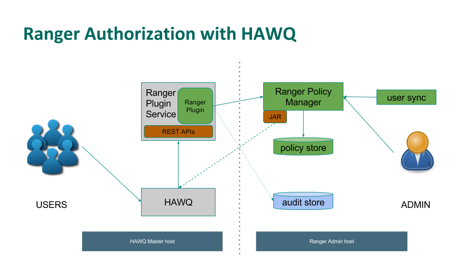

<!--
Licensed to the Apache Software Foundation (ASF) under one
or more contributor license agreements.  See the NOTICE file
distributed with this work for additional information
regarding copyright ownership.  The ASF licenses this file
to you under the Apache License, Version 2.0 (the
"License"); you may not use this file except in compliance
with the License.  You may obtain a copy of the License at

  http://www.apache.org/licenses/LICENSE-2.0

Unless required by applicable law or agreed to in writing,
software distributed under the License is distributed on an
"AS IS" BASIS, WITHOUT WARRANTIES OR CONDITIONS OF ANY
KIND, either express or implied.  See the License for the
specific language governing permissions and limitations
under the License.
-->

HAWQ supports using Apache Ranger for authorizing user access to HAWQ resources. Using Ranger enables you to manage all of your Hadoop components' authorization policies using the same user interface, policy store, and auditing stores.

See the [Apache Ranger documentation](http://ranger.apache.org/) for more information about the core functionality of Ranger.

## Policy Management Architecture

Each HAWQ installation includes a Ranger plug-in service to support Ranger Policy management. The Ranger plug-in service implements the Ranger REST API to bridge all requests between the Ranger Policy Manager and a HAWQ instance. 

HAWQ also provides a JAR library that enables the Ranger Policy Manager to lookup HAWQ metadata (the names of databases, schemas, tables, and so forth) to populate the user interface and assist in creating new policies. This JAR uses a JDBC connection to HAWQ, and requires a one-time registration with the Ranger Policy Manager. See [Configuring HAWQ to use Ranger Policy Management](ranger-integration-config.html).

A single configuration parameter, `hawq_acl_type` determines whether HAWQ defers all policy management to Ranger via the plug-in service, or whether HAWQ handles authorization natively using catalog tables. By default, HAWQ uses SQL commands to create all access policies, and the policy information is stored in catalog tables.  When you enable Ranger integration for policy management, any authorization policies that you have configured in HAWQ using SQL no longer apply to your installation; you must create new policies using the Ranger interface. See [Creating HAWQ Authorization Policies in Ranger](ranger-policy-creation.html).

The Ranger plug-in service caches Ranger policies locally on each HAWQ node to avoid unnecessary round trips between the HAWQ node and the Ranger Policy Manager server.

## Limitations of Ranger Policy Management

In this release, HAWQ integration with Ranger has several limitations:

- Neither Kerberos authentication nor SSL encryption is supported between a HAWQ node and the Ranger plug-in service, or between the plug-in service and the Ranger Policy Manager.

- The Ranger plug-in service is not compatible with Highly-Available HAWQ deployments. Should you need to activate the standby master in your HAWQ cluster, you must manually update the HAWQ Ranger service definition with the new master node connection information.

- Ranger User Group policies cannot be used with HAWQ in this release. Only User Policies are currently supported.

- Some authorization checks for superuser-restricted authorization events are handled by HAWQ natively, even when Ranger integration is enabled. See [HAWQ-Native Authorization](../clientaccess/hawq-access-checks.html#alwaysnative).

