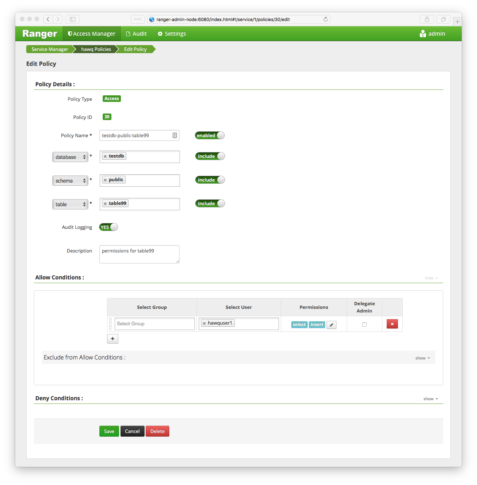
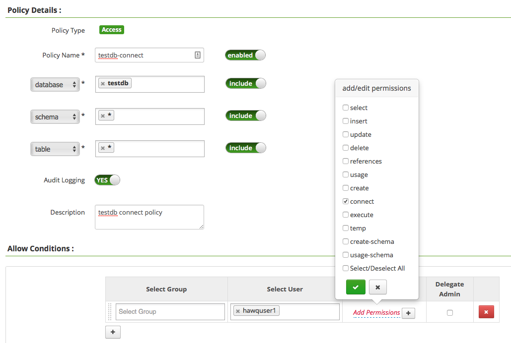
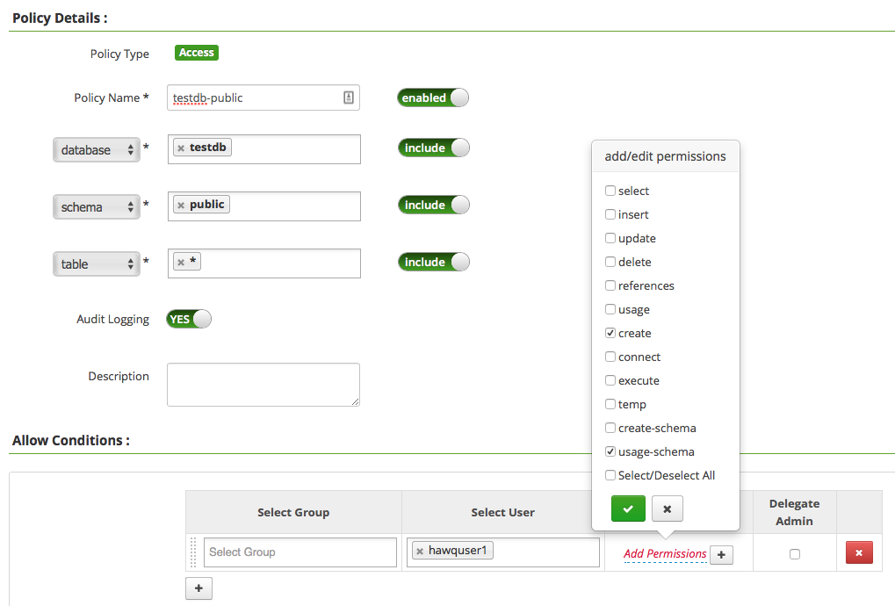
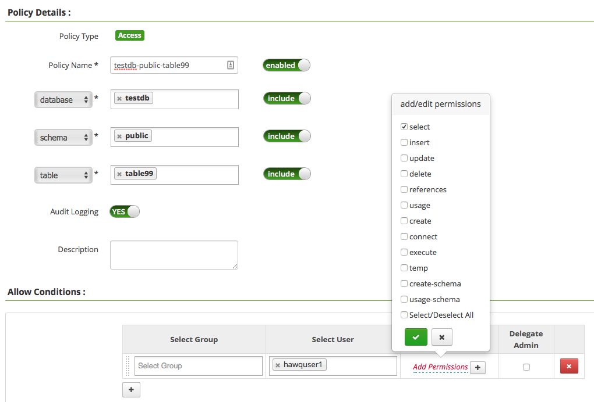

<!--
Licensed to the Apache Software Foundation (ASF) under one
or more contributor license agreements.  See the NOTICE file
distributed with this work for additional information
regarding copyright ownership.  The ASF licenses this file
to you under the Apache License, Version 2.0 (the
"License"); you may not use this file except in compliance
with the License.  You may obtain a copy of the License at

  http://www.apache.org/licenses/LICENSE-2.0

Unless required by applicable law or agreed to in writing,
software distributed under the License is distributed on an
"AS IS" BASIS, WITHOUT WARRANTIES OR CONDITIONS OF ANY
KIND, either express or implied.  See the License for the
specific language governing permissions and limitations
under the License.
-->

Ranger secures your Hadoop services, providing a centralized console to manage user access to the data in your HAWQ cluster.

Native HAWQ authorization provides SQL standard authorization at the database and table level for specific users/roles using the `GRANT` and `REVOKE` SQL commands. HAWQ integration with Ranger provides policy-based authorization, enabling you to identify the conditions under which a user and/or group can access individual HAWQ resources, including the operations permitted on those resources. 

**Note**: The HAWQ `GRANT` and `REVOKE` operations are not permitted when Ranger authorization is enabled for HAWQ; you must configure all user and object access using Ranger policies.


##  Defining HAWQ Policies<a id="policydef"></a>

You configure HAWQ-Ranger authorization with the Ranger Administrative UI, which you can access at `http://<ranger-admin-node>:6080`. To configure a Ranger authorization policy for HAWQ, you:

1.  Name and provide a description for the policy.
2.  Identify the HAWQ resource(s) to which the policy applies.
3.  Identify the conditions under which access to the HAWQ resource(s) should be allowed.
4.  Enable/Disable audit logging for the policy.




###  HAWQ Ranger Resources<a id="createpoliciesresource"></a>

Configure the resources to which a HAWQ policy applies in the **Create Policy > Policy Details** page of the Ranger HAWQ Policy editor. Ranger manages access to the following HAWQ resources:

| Resource    |  Description     |
|-------------|------------------------|
| database |  The database to which you want to provide access |
| schema |  The schema in which you want to provide access |
| table |  The table to which you want to provide access |
| sequence |  The sequence to which you want to provide access |
| function |  The user-defined function to which you want to provide access |
| language |  The language to which you want to provide access |
| tablespace |  The tablespace to which you want to provide access to create databases and tables |
| protocol |  The protocol to which you want to provide access |

The HAWQ Ranger service definition supports only those combinations of resources that reflect the actual scoping of database objects with HAWQ. These combinations are:

- database/schema/table
- database/schema/sequence
- database/schema/function
- database/language
- tablespace
- protocol

The Ranger policy editor provides resource name look-ups. When you start entering characters into a resource field, HAWQ populates a pop-up list with all existing HAWQ object names that match your text. 
 
###  Resource Access Conditions<a id="createpoliciesconditions"></a>

When you define a HAWQ policy using the Ranger Admin UI, you identify the Groups/Users to which the policy will permit or deny access for the specified HAWQ resource(s). You also identify the permissions for the resource(s) that you want to assign or deny to those users. Specify this information in the **Create Policy > Allow Conditions** and **Deny Conditions** panes of the Ranger HAWQ Policy editor.

####  HAWQ Roles<a id="conditionusergroup"></a>

You create HAWQ users with the `createuser` command line utility or `CREATE ROLE` SQL command. These HAWQ users may or may not correspond to an underlying operating system user. With either HAWQ native or Ranger authorization, you identify the HAWQ database objects to which you want these users/roles to have access. 

Ranger includes a `UserSync` process that synchronizes users and groups on the Ranger administration node. You can synchronize users and groups from the operating system (default), from a file, or from LDAP/AD services. After the synchronization source is identified, the Ranger `UserSync` process automatically detects when new users are provisioned on the Ranger administration node.

**Note**: If your HAWQ cluster includes HAWQ-only roles (roles that have no associated operating system user), then you must manually configure a Ranger user for each such role. Use the Ranger Admin UI **Settings > Users/Groups** page for this purpose.

You can identify one or more users and/or groups to which a policy provides or denies access in the Allow/Deny Conditions of a HAWQ policy. These users/groups must be known to Ranger. 

| Field   | Value   |  Description     |
|-------------|----------------------|------------------------|
| Group | \<group-name\> | The group(s) to which you want to provide or deny access. All groups sync'd from \<ranger-admin-node\> are available in the picklist. |
| User | \<user-name\> | The user(s) to which you want to provide or deny access. All users sync'd from \<ranger-admin-node\> or explicitly registered via the Ranger Admin UI are available in the picklist.  |

**Note**: Group-based assignment of policies is not yet supported in HAWQ. Assign policies to users only.

####  Permissions<a id="conditionperms"></a>

You can assign users the following permissions for allowing or denying access to specific HAWQ resources:

| Permission   |  Description     |
|-------------|-----------------------|
| select | Select from a table or sequence, or through a protocol |
| insert | Insert or copy into a table, or insert through a protocol |
| update | Update a sequence value |
| delete | This permission is not used by HAWQ |
| references | This permission is not used by HAWQ |
| usage | Use a language or sequence |
| create | Create a table, function, sequence, etc. |
| connect | Connect to a specific database |
| execute | Create and execute a function |
| temp | Create a temporary table or sequence |
| create-schema | Create a schema |
| usage-schema | Use a schema |

These permissions map closely to the privileges that you can assign using HAWQ `GRANT` commands with native HAWQ authorization.

**Note**: The HAWQ Ranger policy editor always displays the complete list of HAWQ permissions. This list is not filtered by the operations that are actually supported by the resource(s) you have selected. Refer to [HAWQ Resources and Permissions](ranger-resource-perms.html) for the specific permissions supported by each HAWQ resource. Additionally, [SQL Command Permissions Summary](ranger-sqlcmd-summary/index.html) summarizes the policies and permissions required for some common HAWQ SQL commands.


##  Ranger Policy Evaluation<a id="policyeval"></a>
Ranger evaluates policies from most to least restrictive, searching for a policy with sufficient privileges to allow the requesting user to access the identified resource(s). Deny conditions are evaluated before allow conditions.

Refer to the [Ranger User Guide](https://cwiki.apache.org/confluence/display/RANGER/Apache+Ranger+0.5+-+User+Guide) and [Deny-conditions and excludes in Ranger policies](https://cwiki.apache.org/confluence/display/RANGER/Deny-conditions+and+excludes+in+Ranger+policies) for detailed information about the Ranger Admin UI and Ranger policy evaluation.


## Example Scenario: Creating HAWQ Policies<a id="excreatepolicies"></a>

When you enable Ranger authorization for HAWQ with the default service definition in place, the configured policies assign the `gpadmin` administrative HAWQ user all permissions on all database objects. Other HAWQ users have no privileges, *even for the objects that they own*. In this example scenario:

- Your HAWQ cluster includes a HAWQ user named `hawquser1` who has default privileges on a database named `testdb`. 
- `hawquser1` creates `table99` in the `public` schema of `testdb` and inserts data into this table.
- You enable Ranger authorization for HAWQ.
- You create the HAWQ policies necessary to restore `hawquser1` access to the database `testdb` and the table `table99`.

Perform the following steps to set up the example scenario:

1. Create OS user `hawquser1` and assign a password:

    ``` shell
    root@ranger-admin-node$ useradd hawquser1
    root@ranger-admin-node$ passwd hawquser1
    ```

2. Create database `testdb`:

    ``` shell
    gpadmin@master$ createdb testdb
    ```

3. Create a HAWQ user/role associated with OS user `hawquser1`:

    ``` shell
    gpadmin@master$ creatuser hawquser1
    Shall the new role be a superuser? (y/n) n
    Shall the new role be allowed to create databases? (y/n) y
    Shall the new role be allowed to create more new roles? (y/n) n
    ```

4. Add a `pg_hba.conf` entry to allow `hawquser1` to access `testdb`:

    ``` pre
    host    testdb       hawquser1    client_host/32   trust
    ```

    And reload HAWQ configuration:

    ``` shell
    gpadmin@master$ hawq stop cluster --reload
    ```

5. `hawquser1` creates `table99` in `public` schema of `testdb` database:

    ``` shell
    hawquser1@hawq-node$ psql -d testdb
    ```
    
    ``` sql
    testdb=> CREATE TABLE table99( id int );
    CREATE TABLE
    testdb=> INSERT INTO table99 SELECT generate_series(1, 11);
    INSERT 0 11
    testdb=> SELECT * FROM table99;
     id
    ----
      1
      2
    ...
    ```

6. You enable Ranger authorization for HAWQ.

    When you enable Ranger authorization for HAWQ with the default service definition in place, the configured policies assign the `gpadmin` administrative HAWQ user all permissions on all database objects. Other HAWQ users have no privileges, *even for the objects that they own*.

7. `hawquser1` attempts to connect to `testdb` after Ranger authorization for HAWQ is enabled:

    ``` shell
    hawquser1@hawq-node$ psql -d testdb
    psql: FATAL:  permission denied for database "testdb"
    DETAIL:  User does not have CONNECT privilege.
    ```

    Notice that `hawquser1` no longer has permission to access `testdb` after Ranger authorization for HAWQ is enabled.


Create the policies(s) that restore `hawquser1`'s access to `testdb` and `table99`:

1. You configure HAWQ Ranger authorization policies using the Ranger Administrative UI, which you access at `http://<ranger-admin-node>:6080`. Log in to the Ranger Administrative UI as the Ranger `admin` user.

2. Open the **Settings > Users/Groups** page, and verify the `hawquser1` user has been sync'd to Ranger.

3. Click the **Access Manager** button and select the default HAWQ service definition named `hawq`.

    The **List of Policies: hawq** page identifies all currently defined HAWQ policies. These policies provide all permissions on all HAWQ database resources only to the `gpadmin` user.

4. Create a policy for `hawquser1` that provides `CONNECT` privilege to the `testdb` database. 

    Click the **Add New Policy** button and enter the following information in the **Policy Details** and **Allow Conditions** fields:
    
    
    
    Notice that both the `schema` and `table` field values are set to `*` in this policy. Wild-carding both of these fields is **required** when defining a database-level policy.
    
5. Save the policy named `testdb-connect`.

6. Verify that `hawquser1` can now connect to `testdb`:

    ``` shell
    hawquser1@hawq-node$ psql -d testdb
    ```
    
    ``` sql
    testdb=>
    ```

7. `hawquser1` attempts to select from `table99`:

    ``` sql
    testdb=> SELECT * FROM table99;
    WARNING:  usage privilege of namespace public is required.
    ```
    
    Connect privilege to the `testdb` database is not sufficient for `hawquser1` to access `table99`. The WARNING message indicates that `hawquser1` is missing privileges for the `public` schema.
    
8. Create a policy for `hawquser1` that provides `USAGE` privileges on the `testdb` database `public` schema. 

    Click the **Add New Policy** button and enter the following information in the **Policy Details** and **Allow Conditions** fields:
    
    
    
    Notice that the `table` field value is set to `*` in this policy and that  you assign the schema-level `usage-schema` and `create` permissions. The `usage-schema` permission allows `hawquser1` to use the `public` schema. The `create` permission allows `hawquser1` to create objects in this schema.
    
9. Save the policy named `testdb-public`.

10. `hawquser1` again attempts to select from `table99`:

    ``` sql
    testdb=> SELECT * FROM table99;
    ERROR:  permission denied for relation(s): public.table99
    ```
    
    Access to the `testdb` database and `public` schema is still not sufficient for `hawquser1` to select the data in `table99`. You must explicitly configure access to this table.
    
11. Create a policy for `hawquser1` that provides `SELECT` permission on the table named `table99`. 

    Click the **Add New Policy** button and enter the following information in the **Policy Details** and **Allow Conditions** fields:
    
    

12. Save the policy named `testdb-public-table99`.

13. `hawquser1` again attempts to select from `table99`:

    ``` sql
    testdb=> SELECT * FROM table99;
     id
    ----
      1
      2
    ...
    ```
    
    `hawquser1` regains access to `table99` only after the `testdb-connect`, `testdb-public`, and `testdb-public-table99` policies are assigned.


##  Wildcarding in HAWQ Policies<a id="wildcardinpolicies"></a>

The policy editor allows you to wildcard (`*`) resources and patterns in policy details. The permissions you provide to the leaf node resource in a  wild-carded policy scope the policy in one of the following ways:

- parent-level permission - the permission applies to the parent resource
- leaf permission -  the permission applies to all instances of the resource at the leaf level.

For example, consider the following two policies that are assigned to user `hawquser1` for a table named `table99` in the `public` schema of database `testdb`:

    Policy 1: testdb/public/*(table), usage-schema permission  
    Policy 2: testdb/public/table99, select permission

Policies 1 and 2 collectively permit `hawquser1` to access the `public` schema of `testdb` and to select from `table99` in that schema. The wildcard in Policy 1 applies the `usage-schema` permission to the parent resource (the schema `public`). Policy 2 restricts the `select` operation to the specific table named `table99`.

Contrast this with the single policy:

    Policy 10: testdb/public/*(table), usage-schema and select permissions

Policy 10 permits the policy holder to use the `public` schema (equivalent to Policy 1 above) and select from *any* table in the schema. In this policy, `select` is a table-level permission, and the wildcard character applies this permission to all instances of the leaf table resource.


## Best Practices<a id="bestpract"></a>
The following best practices are recommended when considering Ranger authorization for HAWQ:

- Create policies *before* enabling HAWQ-Ranger authorization. This will ensure access is available to users without any downtime.
- Define more restrictive HAWQ policies first to ensure that you do not accidentally provide unwanted access to specific resources.
- Identify and configure your Ranger auditing requirements *before* enabling HAWQ-Ranger authorization.
- Administrators periodically perform maintentance tasks on the HAWQ cluster, including vacuuming and analyzing databases. Users performing these operations must be the owner of the databases, and must be explicitly assigned the permissions to do so, just as you would for general database operations.
    - The `ANALYZE` operation requires `select` permission on the table to be analyzed, as well as `usage-schema` permissions on the schema in which the table resides.
    - The `VACUUM ANALYZE` operation requires `select` permission on all table(s) specified, as well as `usage-schema` permissions on the schema(s) in which the tables reside.
    - The `VACUUM` and `TRUNCATE` operations require `usage-schema` permissions on the schema in which the table resides.

 
## Special Considerations<a id="specialconsider"></a>

Make note of the following considerations when employing Ranger authorization for HAWQ:

- The `psql` `search_path` session configuration parameter affects Ranger access control checks for `CREATE` operations. The object will be created under the *first* schema in the `search_path` in which `usage-schema` permissions were assigned to the user. The schema `search_path` does not affect `SELECT` or other operations.

- When Ranger authorization is enabled for HAWQ, members of HAWQ roles assigned create database permissions must be provided `pg_hba.conf` access to the `postgres` database to use the `createdb` command line utility. This configuration step is not required for `CREATE DATABASE` operations invoked within the `psql` shell.

- `CREATE LANGUAGE` commands (superuser-only) issued for non-built-in languages (pljava, plpython, ..) require the `usage` permission for the `c` language.

- Using built-in functions may generate the message:  “WARNING: usage privilege of namespace \<schema-name\> is required.” This message is displayed even though the usage permission on \<schema-name\> is not actually required to execute the built-in function.

- When Ranger authorization is enabled for HDFS in your HAWQ cluster:
    - The HDFS `xasecure.add-hadoop-authorization` property determines whether or not HDFS access controls are used as a fallback when no policy exists for a given HDFS resource. HAWQ access to HDFS is not affected when the `xasecure.add-hadoop-authorization` property is set to `true`. When this property is set to `false`, you must define HDFS Ranger policies permitting the `gadmin` HAWQ user read/write/execute access to the HAWQ HDFS filespace. 
    - Access to HDFS-backed PXF external tables is not affected by the `xasecure.add-hadoop-authorization` property value, since the `pxf` user is a member of the `hdfs` superuser group.

- Hive Ranger policies cannot control PXF access to Hive tables.
    -  When Ranger authorization is enabled for HAWQ, the `gpadmin` user has access permissions to all Hive tables exposed through PXF external tables and HCatalog integration.
    - Other HAWQ users may gain access to Hive-backed PXF external tables when provided `usage-schema` and `create` permissions on the `public` or any private schema. To restrict this access, selectively assign permissions to the `pxf` protocol. 
    - HCatalog access to Hive tables is restricted by default when Ranger authorization is enabled for HAWQ; you must create policies to explicitly allow this access.
