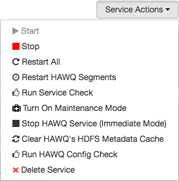
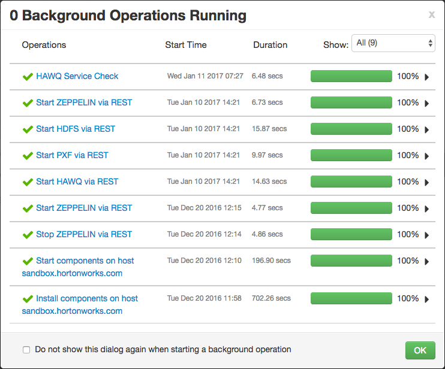
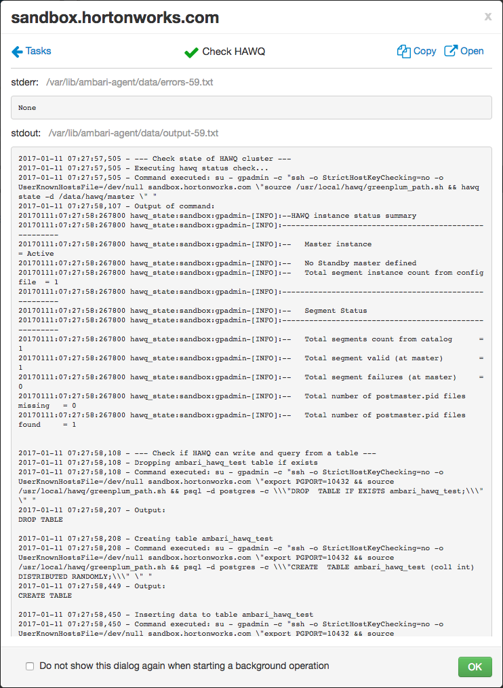
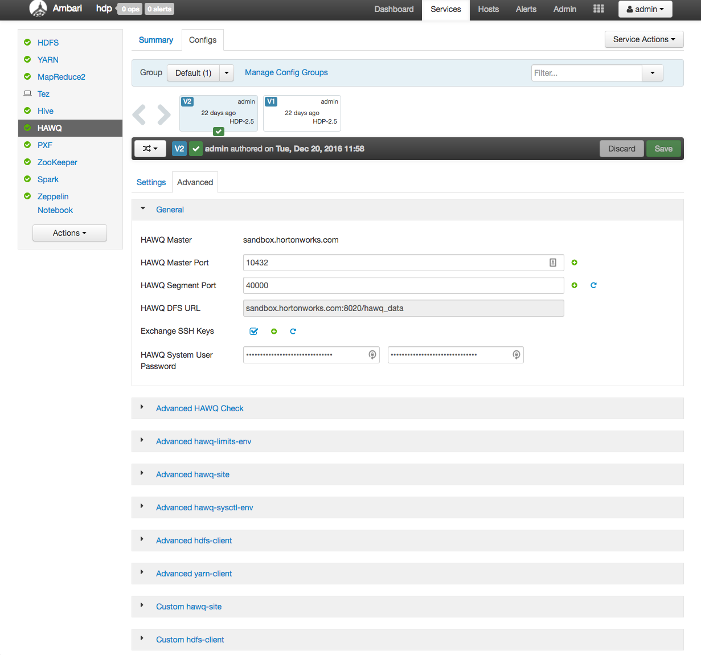
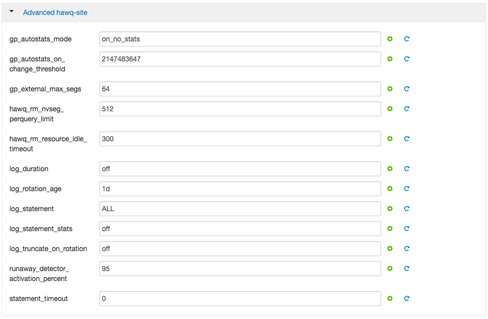
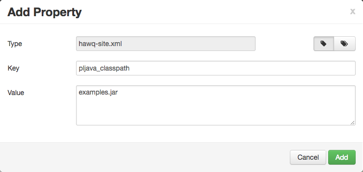

<!--
Licensed to the Apache Software Foundation (ASF) under one
or more contributor license agreements.  See the NOTICE file
distributed with this work for additional information
regarding copyright ownership.  The ASF licenses this file
to you under the Apache License, Version 2.0 (the
"License"); you may not use this file except in compliance
with the License.  You may obtain a copy of the License at

  http://www.apache.org/licenses/LICENSE-2.0

Unless required by applicable law or agreed to in writing,
software distributed under the License is distributed on an
"AS IS" BASIS, WITHOUT WARRANTIES OR CONDITIONS OF ANY
KIND, either express or implied.  See the License for the
specific language governing permissions and limitations
under the License.
-->

The HAWQ `gpadmin` administrative user has super-user capabilities on all HAWQ databases and HAWQ cluster management commands.

HAWQ configuration parameters affect the behaviour of both the HAWQ cluster and individual HAWQ nodes.

This lesson introduces basic HAWQ cluster administration tasks. You will view and update HAWQ configuration parameters.

**Note**: Before installing HAWQ, you or your administrator choose to configure and manage the HAWQ cluster either using the command line or using the Ambari UI. You will perform command line and Ambari exercises for managing your HAWQ cluster in this lesson. Although you are introduced to both, command line and Ambari HAWQ cluster management modes should not be mixed.

##  Prerequisites<a id="tut_adminprereq"></a>

Ensure that you have [Set Up your HAWQ Runtime Environment](introhawqenv.html#tut_runtime_setup) and that your HAWQ cluster is up and running.

## Exercise: View and Update HAWQ Configuration from the Command Line<a id="tut_ex_cmdline_cfg"></a>

If you choose to manage your HAWQ cluster from the command line, you will perform many administrative functions using the `hawq` utility. The `hawq` command line utility provides subcommands including `start`, `stop`, `config`, and `state`.

In this exercise, you will use the command line to view and set HAWQ server configuration parameters. 

Perform the following steps to view the HAWQ HDFS filespace URL and set the `pljava_classpath` server configuration parameter:

1. The `hawq_dfs_url` configuration parameter identifies the HDFS NameNode (or HDFS NameService if HDFS High Availability is enabled) host, port, and the HAWQ filespace location within HDFS. Display the value of this parameter:

    ``` shell
    gpadmin@master$ hawq config -s hawq_dfs_url
    GUC	   : hawq_dfs_url
    Value  : <hdfs-namenode>:8020/hawq_data
    ```
    
    Make note of the <hdfs-namenode> hostname or IP address returned, you will need this in *Lesson 6: HAWQ Extension Framework (PXF)*.

2. The HAWQ PL/Java `pljava_classpath` server configuration parameter identifies the classpath used by the HAWQ PL/Java extension. View the current `pljava_classpath` configuration parameter setting:

    ``` shell
    gpadmin@master$ hawq config -s pljava_classpath
    GUC		: pljava_classpath
    Value   :
    ```
    
    The value is currently not set, as indicated by the empty `Value`.

3. Your HAWQ installation includes an example PL/Java JAR file. Set `pljava_classpath` to include the `examples.jar` file installed with HAWQ:

    ``` shell
    gpadmin@master$ hawq config -c pljava_classpath -v 'examples.jar'
    GUC pljava_classpath does not exist in hawq-site.xml
    Try to add it with value: examples.jar
    GUC	    : pljava_classpath
    Value   : examples.jar
    ```

    The message 'GUC pljava\_classpath does not exist in hawq-site.xml; Try to add it with value: examples.jar' indicates that HAWQ could not find a previous setting for `pljava_classpath` and attempts to set this configuration parameter to `examples.jar`, the value you provided with the `-v` option.

3. You must reload the HAWQ configuration after setting a configuration parameter: 

    ``` shell
    gpadmin@master$ hawq stop cluster --reload
    20170411:19:58:17:428600 hawq_stop:master:gpadmin-[INFO]:-Prepare to do 'hawq stop'
    20170411:19:58:17:428600 hawq_stop:master:gpadmin-[INFO]:-You can find log in:
    20170411:19:58:17:428600 hawq_stop:master:gpadmin-[INFO]:-/home/gpadmin/hawqAdminLogs/hawq_stop_20170411.log
    20170411:19:58:17:428600 hawq_stop:master:gpadmin-[INFO]:-GPHOME is set to:
    20170411:19:58:17:428600 hawq_stop:master:gpadmin-[INFO]:-/usr/local/hawq/.
    20170411:19:58:17:428600 hawq_stop:master:gpadmin-[INFO]:-Reloading configuration without restarting hawq cluster

    Continue with HAWQ service stop Yy|Nn (default=N):
    > 
    ```
    
    Reloading configuration does not actually stop the cluster, as noted in the INFO messages above.
    
    HAWQ prompts you to confirm the operation. Enter `y` to confirm:
    
    ``` shell
    > y
    20170411:19:58:22:428600 hawq_stop:master:gpadmin-[INFO]:-No standby host configured
    20170411:19:58:23:428600 hawq_stop:master:gpadmin-[INFO]:-Reload hawq cluster
    20170411:19:58:23:428600 hawq_stop:master:gpadmin-[INFO]:-Reload hawq master
    20170411:19:58:23:428600 hawq_stop:master:gpadmin-[INFO]:-Master reloaded successfully
    20170411:19:58:23:428600 hawq_stop:master:gpadmin-[INFO]:-Reload hawq segment
   20170411:19:58:23:428600 hawq_stop:master:gpadmin-[INFO]:-Reload segments in list: ['segment']
   20170411:19:58:23:428600 hawq_stop:master:gpadmin-[INFO]:-Total segment number is: 1
..
    20170411:19:58:25:428600 hawq_stop:master:gpadmin-[INFO]:-1 of 1 segments reload successfully
    20170411:19:58:25:428600 hawq_stop:master:gpadmin-[INFO]:-Segments reloaded successfully
    20170411:19:58:25:428600 hawq_stop:master:gpadmin-[INFO]:-Cluster reloaded successfully
    ```

    Configuration parameter value changes made by `hawq config` are system-wide; they are propagated to all segments across the cluster.


## Exercise: View the State of Your HAWQ Cluster via Ambari<a id="tut_ex_hawqstatecmdline"></a>

You may choose to use Ambari to manage the HAWQ deployment. The Ambari Web UI provides a graphical front-end to HAWQ cluster management activities.

Perform the following steps to view the state of your HAWQ cluster via the Ambari web console:

1. Start the Ambari web UI: 

    ``` shell
    <ambari-server-node>:8080
    ```
    
    Ambari runs on port 8080.

2. Log in to the Ambari UI using the Ambari user credentials.

    The Ambari UI dashboard window displays.

3. Select the **HAWQ** service from the service list in the left pane.

    The HAWQ service page **Summary** tab is displayed.  This page includes a **Summary** pane identifying the HAWQ master and all HAWQ segment nodes in your cluster. The **Metrics** pane includes a set of HAWQ-specific metrics tiles.

4. Perform a HAWQ service check operation by selecting the **Run Service Check** item from the **Service Actions** button drop-down menu and **Confirm**ing the operation.

    

    The **Background Operations Running** dialog displays. This dialog identifies all service-related operations performed on your HAWQ cluster.
    
    
    
5. Select the most recent **HAWQ Service Check** operation from the top of the **Operations** column. Select the HAWQ master host name from the **HAWQ Service Check** dialog, and then select the **Check HAWQ** task.

    

    The **Check HAWQ** task dialog displays the output of the service check operation. This operation returns the state of your HAWQ cluster, as well as the results of HAWQ database operation tests performed by Ambari.


## Exercise: View and Update HAWQ Configuration via Ambari<a id="tut_ex_ambari_cfg"></a>

Perform the following steps to view the HDFS NodeName and set the HAWQ PL/Java `pljava_classpath` configuration parameter and value via Ambari:

1. Navigate to the **HAWQ** service page.
    
2. Select the **Configs** tab to view the current HAWQ-specific configuration settings.

    HAWQ general settings displayed include master and segment data and temp directory locations, as well as specific resource management parameters.
    
3. Select the **Advanced** tab to view additional HAWQ parameter settings.

    

    The **General** drop down pane opens. This tab displays information including the HAWQ master hostname and master and segment port numbers.
    
4. Locate the **HAWQ DFS URL** configuration parameter setting in the **General** pane. This value should match that returned by `hawq config -s hawq_dfs_url` in the previous exercise. Make note of the HDFS NameNode hostname or IP address if you have not done so previously.

    **Note**: The **HDFS** service, **Configs > Advanced Configs** tab also identifies the HDFS NameNode hostname.
    
4. **Advanced \<config\>** and **Custom \<config\>** drop down panes provide access to advanced configuration settings for HAWQ and other cluster components. Select the **Advanced hawq-site** drop down.

    

    Specific HAWQ configuration parameters and values are displayed in the pane. Hover the mouse cursor over the value field to display a tooltip description of a specific configuration parameter.

5. Select the **Custom hawq-site** drop down.

    Currently configured custom parameters and values are displayed in the pane.  If no configuration parameters are set, the pane will be empty.

6. Select **Add Property ...**.

    The **Add Property** dialog displays. This dialog includes **Type**, **Key**, and **Value** entry fields.

7. Select the single property add mode (single label icon) in the **Add Property** dialog and fill in the fields:

    **Key**: pljava_classpath  
    **Value**: examples.jar
    
    
    
8. **Add** the custom property, then **Save** the updated configuration, optionally providing a **Note** in the **Save Configuration** dialog.
    
    
    
    Notice the now orange-colored **Restart** button in the right corner of the window. You must restart the HAWQ service after adding or updating configuration parameter values through Ambari.

9. Select the orange **Restart** button to **Restart All Affected** HAWQ nodes.

    You can monitor the restart operation from the **Background Operations Running** dialog.

10. When the restart operation completes, log out of the Ambari console by clicking the **admin** button and selecting the **Sign out** drop down menu item.

## Summary<a id="tut_hawqadmin_summary"></a>

In this lesson, you viewed the state of the HAWQ cluster and learned how to change cluster configuration parameters. 

For additional information on HAWQ server configuration parameters, see [Server Configuration Parameter Reference](../../reference/HAWQSiteConfig/index.html).

The following table identifies HAWQ management commands used in the tutorial exercises. For detailed information on specific HAWQ management commands, refer to the [HAWQ Management Tools Reference](../../reference/cli/management_tools/index.html).

<a id="topic_table_clustmgmtcmd"></a>

| Action                                                    | Command                                                                                                                                                                                            |
|-------------------------------------------------------------------|-----------------------------------------------------------------------------------------------------------------------------------------------------------------------------------------------------|
| Get HAWQ cluster status | `$ hawq state` |
| Start/stop/restart HAWQ \<object\> (cluster, master, segment, standby, allsegments) | `$ hawq start <object>` <p> `$ hawq stop <object>` <p> `$ hawq restart <object>` |
| List all HAWQ configuration parameters and their current settings     | `$ hawq config -l`                                                                                         |
| Display the current setting of a specific HAWQ configuration parameter    | `$ hawq config -s <param-name>`                                                                                         |
| Add/change the value of HAWQ configuration parameter (command-line managed HAWQ clusters only)  | `$ hawq config -c <param-name> -v <value>`                                                                                         |
| Reload HAWQ configuration        | `$ hawq stop cluster --reload`                                                                                         |


Lesson 3 introduces basic HAWQ database administration activities and commands.

**Lesson 3**: [Database Administration](basicdbadmin/index.html)
